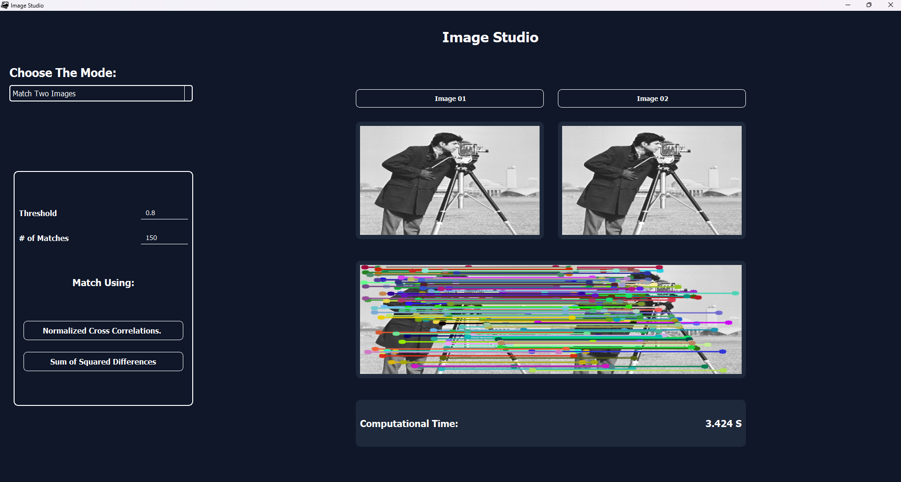

# Feature Extractor 

A comprehensive computer vision application built with PyQt5 that implements advanced feature detection, extraction, and image matching algorithms. This professional-grade tool provides an intuitive GUI for performing sophisticated computer vision operations including Harris corner detection, SIFT feature descriptors, and multiple image matching techniques.

## Preview




## ✨ Features

### 🎯 Feature Detection & Extraction
- **Harris Corner Detection**: Detect corner features with adjustable sensitivity and window parameters
- **Lambda-Minus Feature Extraction**: Alternative corner detection method with customizable thresholds
- **Real-time Parameter Adjustment**: Interactive controls for fine-tuning detection parameters
- **Performance Metrics**: Built-in timing measurements for algorithm performance analysis

### 🔍 SIFT Implementation
- **Scale-Invariant Feature Transform**: Full SIFT pipeline implementation from scratch
- **Customizable Parameters**: Adjustable sigma, number of octaves, and scale intervals
- **Keypoint Visualization**: Color-coded keypoint display with orientation indicators
- **Descriptor Generation**: 128-dimensional feature descriptors for robust matching

### 🔗 Image Matching
- **SSD (Sum of Squared Differences)**: Fast template-based matching algorithm
- **NCC (Normalized Cross-Correlation)**: Robust correlation-based matching method
- **Match Visualization**: Interactive display of matched feature pairs between images
- **Threshold Control**: Adjustable matching sensitivity and maximum match count

### 🖥️ User Interface
- **Modern GUI Design**: Clean, professional interface built with PyQt5
- **Multi-Mode Operation**: Seamless switching between different processing modes
- **Real-time Feedback**: Instant visual feedback and processing time display
- **Image Management**: Easy image loading and side-by-side comparison views

## 🚀 Quick Start

### Prerequisites
- Python 3.8 or higher
- pip package manager

### Installation

1. **Clone the repository**
   ```bash
   git clone https://github.com/Youssef-Abo-El-Ela/Image-Studio-CV-Task-03.git
   cd Image-Studio-CV-Task-03
   ```

2. **Install dependencies**
   ```bash
   pip install -r requirements.txt
   ```

3. **Run the application**
   ```bash
   python main.py
   ```

## 📋 Requirements

The application requires the following Python packages:

```txt
PyQt5>=5.15.0
opencv-python>=4.5.0
numpy>=1.20.0
Pillow>=8.0.0
```

## 🎮 Usage Guide

### Getting Started

1. **Launch the Application**: Run `python main.py` to start the Image Studio
2. **Select Mode**: Choose from three available processing modes using the dropdown menu:
   - Extract The Unique Features
   - Generate Feature Descriptors  
   - Match Two Images

### Feature Extraction Mode

1. **Load Image**: Click the "Browse" button to select an input image
2. **Choose Algorithm**: 
   - **Harris Corner Detection**: Adjust threshold, sigma, and window size parameters
   - **Lambda-Minus**: Configure threshold, sigma, and window size settings
3. **Process**: Click "Apply" to detect features
4. **View Results**: Extracted features are displayed with performance timing

### SIFT Descriptor Mode

1. **Load Image**: Browse and select your input image
2. **Configure SIFT Parameters**:
   - **Sigma**: Base Gaussian blur parameter (default: 1.6)
   - **Octaves**: Number of scale octaves (default: 4)
3. **Generate Descriptors**: Click "Apply SIFT" to extract features
4. **Visualize**: View detected keypoints with orientation and scale information

### Image Matching Mode

1. **Load Images**: 
   - Select first image using "Browse Image 1"
   - Select second image using "Browse Image 2"
2. **Set Parameters**:
   - **Threshold**: Matching sensitivity (0.0-1.0)
   - **Max Matches**: Maximum number of matches to display
3. **Choose Algorithm**: Select SSD or NCC matching method
4. **Match**: Click the corresponding apply button to perform matching
5. **Results**: View matched features with connecting lines

##  Contributors
<table>
  <tr>
    </td>
    <td align="center">
    <a href="https://github.com/karreemm" target="_black">
    
    <br />
    <sub><b>Kareem Abdel nabi</b></sub></a>
    </td>
    <td align="center">
    <a href="https://github.com/Youssef-Abo-El-Ela" target="_black">
    
    <br />
    <sub><b>Youssef Aboelela</b></sub></a>
    <td align="center">
    <a href="https://github.com/aliyounis33" target="_black">
    
    <br />
    <sub><b>Ali Younis</b></sub></a>
    </td>
    <td align="center">
    <a href="https://github.com/louai111" target="_black">
    
    <br />
    <sub><b>Louai Khaled</b></sub></a>
    </td>
      </tr>
</table>
